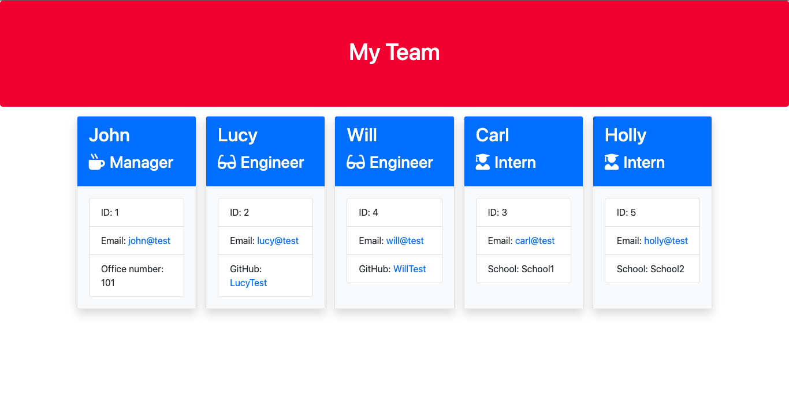

# Team-Profile-Generator

    

[](https://opensource.org/licenses/MIT)

## Description
This is a Node.JS command-line application to generate a team profile.
This is done by asking the user a question of what type of employee they would like to add to their team profile. The possible types of employees are:
* Managers
* Engineers
* Interns

When the user decides the type of employee they want to add they will be provided with set of questions about said employee such as Name, ID and Email address.

This project is developed using Node.JS and NPM with the use of Inquirer, Path, FS packages and Jest to provide some testing.

## Table of Content
* [Installation](#installation)
* [Usage](#usage)
* [Examples](#examples)
* [Technologies Used](#technologies-used)
* [Tests](#tests)
* [License](#license)
* [Questions](#questions)

## Installation
To install, firstly clone the repository down to your local machine.

Then run 
```
npm install
```
Your Team Profile generator should be ready to run.

## Usage
Run the code from your console using
```
node index.js
```
this will start the process to generate your Team Profile.

## Examples

### Sample HTML
This [sample HTML](./output/team.html) provides an example of a Team Profile generated by this application.

### Screenshot of generated Team Profile


### How to use Team Profile Generator


## Technologies Used
* Node.JS V19.6.0
* NPM V9.4.0
* Inquirer Package V8.2.4
* FS Package
* Jest Package V29.4.3

## Tests
This project includes unit tests written using the Jest framework, to run the tests use
```
npm run test
```

## License
Distributed under the MIT License.

Please see https://opensource.org/licenses/MIT to find out more.

## Questions
If you have any questions, Please contact me through:
* GitHub: [AlexAins](https://github.com/AlexAins)